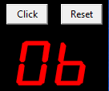
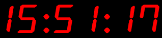
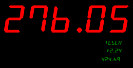
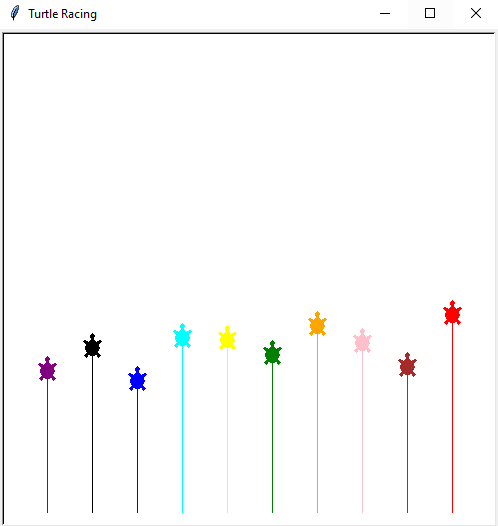

# Python GUIs

Graphic User Interfances project done in Python:

**Automatic Counter** - Counter Window in Tkinter that automatic count from 0 to 99.  

**Manual Counter** - Counter Window in Tkinter that manual count from 0 to 99.  

**Clock Window** - Clock Window in Tkinter that shows the current time.  

**Stock Window** - Stock Window in Tkinter that shows the current price of a stock through an API.  

**Turtle Race** - Game with Turtle module that simulate a race with turtles.  

